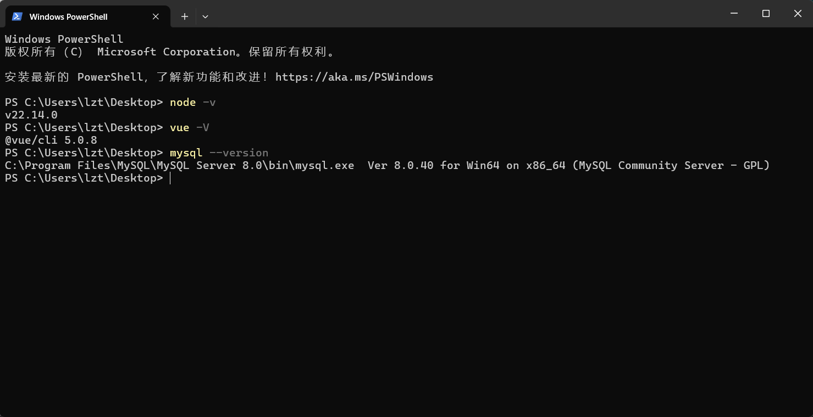
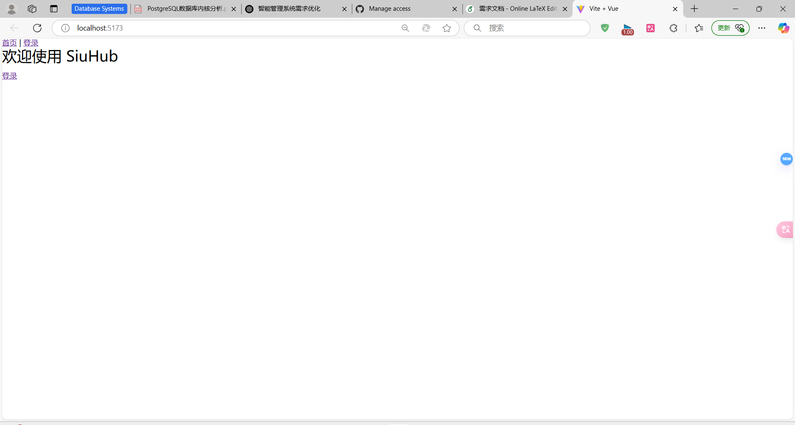

# SiuHub 项目

## 📌 项目简介
SiuHub 是一个基于 **Vue 3 + Vite + Node.js + MySQL** 的业余球队管理系统，包含 **用户管理、球队管理、比赛管理、战术设计、论坛互动** 等功能。

---

## **🚀 1. 环境检查**
### **🔍 检查是否安装 Node.js**
```bash
node -v
```

### **🔍 检查是否安装 Vue CLI**
```bash
vue -V
```

### **🔍 检查是否安装 MySQL**
```bash
mysql --version
```
如果所有都正常安装应该是下面这个图的样子，版本不一样最好也改成一样的（MySQL的账号密码最好改成：123456）


## **📥 2. 下载项目代码**

1.**打开GitHub网址**：https://github.com/klearnin/SiuHub
2.**下载代码的Zip文件**
3.**解压后进入SiuHub目录**

## **🖥️ 3. 运行后端**

### **📌 1. 进入后端目录**
```bash
cd SiuHub/backend
```

### **📌 2. 安装后端依赖**
```bash
npm install
```

### **📌 3. 配置数据库**
```bash
mysql -u root -p
```
输入密码123456后，执行：
```sql
CREATE DATABASE siuhub;
```
然后退出：
```sql
EXIT;
```

### **📌 4. 运行后端服务器**
```bash
node src/server.js
```
成功后，终端会输出：
```bash
Server running on port 5000
Database connected
```

## **🌐 4. 运行前端**

### **📌 1. 进入前端目录**
```bash
cd ../frontend
```

### **📌 2. 安装前端依赖**
```bash
npm install
```

### **📌 3. 运行前端**
```bash
npm run dev
```
成功后，终端会输出：
```bash
  VITE v6.x.x  ready in 300 ms
  ➜  Local:   http://localhost:5173/
```
用浏览器访问 http://localhost:5173/ 即可，正常应该会生成这样的界面：
